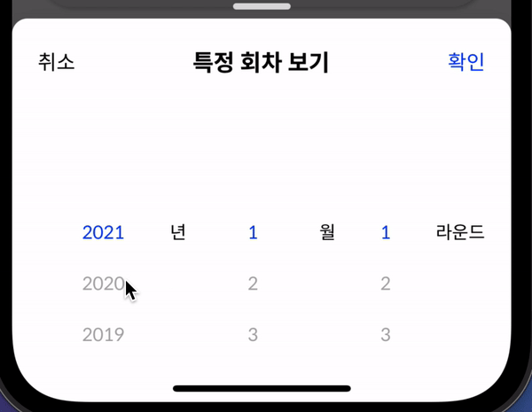
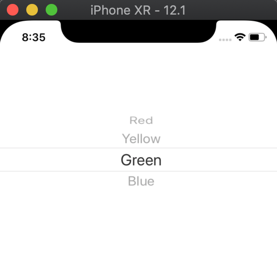
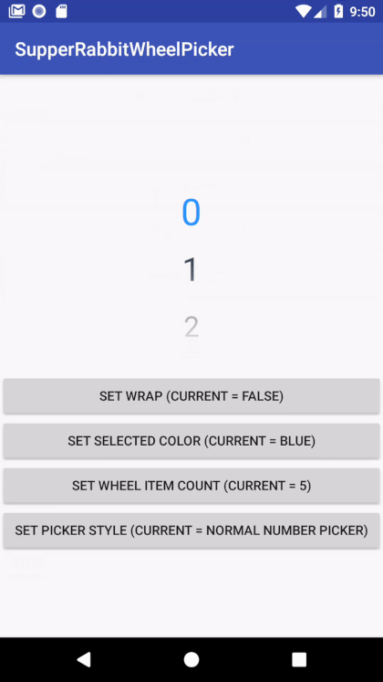
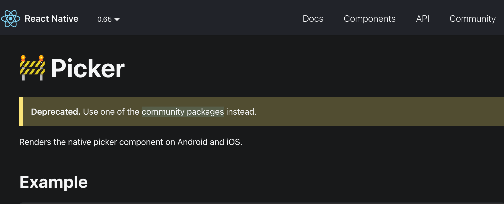

# [React Native] Draggable Picker 만들기

안녕하세요 Getcha Frontend 개발자 Nick입니다.
오늘은 Draggable Picker 개발기를 소개하겠습니다.

## Draggable Picker란?



다음 사진들과 같이 여러개의 선택지 중 하나를 선택하도록 하는 UI입니다.





---

## 왜 만들었느냐

네 저도 라이브러리 가져다 쓰고 싶었습니다.
이와 같은 UI를 요구 받았을 때 당연히 누가 만들어놨겠지 하고 찾아봤는데, 없습니다. 저 위에 두가지 Picker가 제가 알기로 각각 Native Platform에서 제공하는 공식 Picker들이라서 React Native에서 당연히 기본 제공할 줄 알았는데 제공하지 않았습니다.


공식홈피에서 제공하는 picker는 이미 샤따를 내린 후였다...

저기에 community packages를 눌러서 가보면 다양한 Picker 패키지들이 있지만 다 이상한 모양이었습니다. 제가 원하던게 없었습니다.

하지만 만약 있었다고 한들 디자인이 달랐을 수도 있고 저희 팀에서 사용하는 Primary Color나 Font등을 입힐 수 없다는 점과 Picker의 디자인이 안드로이드와 IOS가 너무 차이가 나서 이 경험을 하나로 통일시켜줄 UI가 필요했습니다. 그래서 직접 제작해보기로 했습니다.

간단히 FlatList 컴포넌트를 활용하면 비슷하게 나오지 않을까 하는 생각에 아래와 같은 방식으로 시도해보았습니다.

## 코드

```tsx
import React, { useState, useRef } from "react";
import {
  View,
  Text,
  FlatList,
  TouchableOpacity,
  NativeSyntheticEvent,
  NativeScrollEvent,
} from "react-native";

interface SliderPickerProps {
  data: number[];
  suffix: string;
  index: number;
}

const SliderPicker = (props: SliderPickerProps) => {
  const { data, suffix } = props;
  const ref = useRef<FlatList>(null);
  const [focusIndex, setFocusIndex] = useState(2);

  const renderItem = ({ item, index }: { item?: number; index: number }) => {
    return (
      <TouchableOpacity
        onPress={() =>
          ref.current?.scrollToOffset({ offset: 40 * (index - 2) })
        }
        style={{
          height: 40,
          alignItems: "center",
          justifyContent: "center",
        }}
      >
        <Text style={{ color: index === focusIndex ? "#0038ff" : "#aaa" }}>
          {item}
        </Text>
      </TouchableOpacity>
    );
  };
  const onScrollAndEnd = (e: NativeSyntheticEvent<NativeScrollEvent>) => {
    console.log("Offset : ", e.nativeEvent.contentOffset.y);
    setFocusIndex(Math.round(e.nativeEvent.contentOffset.y / 40) + 2);
  };

  return (
    <View
      style={{
        backgroundColor: "#fff",
        height: 200,
        flex: 1,
        flexDirection: "row",
        alignItems: "center",
      }}
    >
      <FlatList
        ref={ref}
        showsVerticalScrollIndicator={false}
        data={[undefined, undefined, ...data, undefined, undefined]}
        renderItem={renderItem}
        keyExtractor={(item, index) => index.toString()}
        snapToAlignment="center"
        snapToStart={true}
        snapToInterval={40}
        bounces={false}
        onScroll={onScrollAndEnd}
        onScrollEndDrag={onScrollAndEnd}
        getItemLayout={(data, index) => ({
          length: 40,
          offset: 40 * index,
          index,
        })}
      />
      <Text>{suffix}</Text>
    </View>
  );
};

export default SliderPicker;
```

핵심 아이디어는가 다음과 같았습니다.

- 보여지는 아이템 숫자를 5개로 제한한다.
- 아이템의 앞 뒤로 2개씩 undefind 아이템을 넣어준다(이건 선택 할 수 없음!)
- focusIndex라는 값을 세팅한다

여기서 focusIndex는 FlatList를 스크롤함에 따라 맨 윗부분과 컨텐츠 간의 차이인 y offset을 개별 아이템의 컨테이너 사이즈인 40으로 나눈 값을 반올림한 뒤 2를 더해서 항상 2번 index를 가리키도록 만들었습니다.

밑에 suffix는 년, 월, 라운드 등 뒤에 단위를 붙혀줄 때 사용했습니다. 범용성을 더하기 위해서.

현재 상태는 데이터를 조작할 수 없는데, 데이터는 부모 View에서 State로 관리해주면 되니까 별 문제 없다고 생각했습다.

## 끝으로

이 컴포넌트는 생각보다 동작을 잘 해서 범용성을 조금 더해 npm 라이브러리로 배포해볼 생각입니다.
배포된다면 배포 과정을 담은 포스트로 다시 돌아오겠습니다.

감사합니다.
