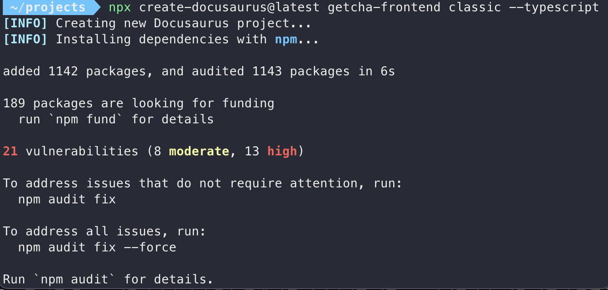
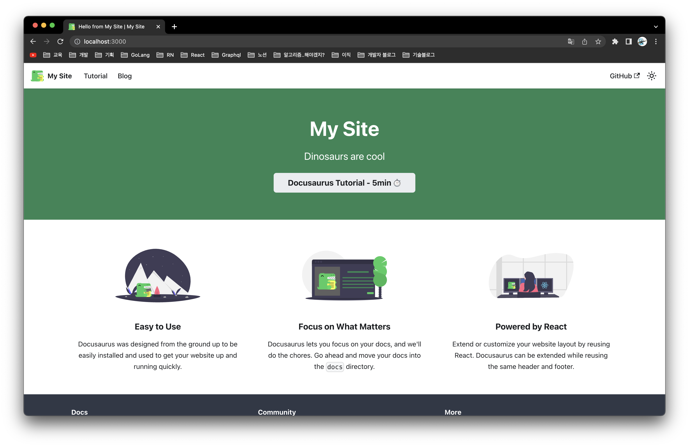
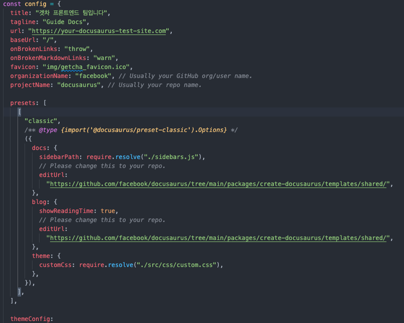
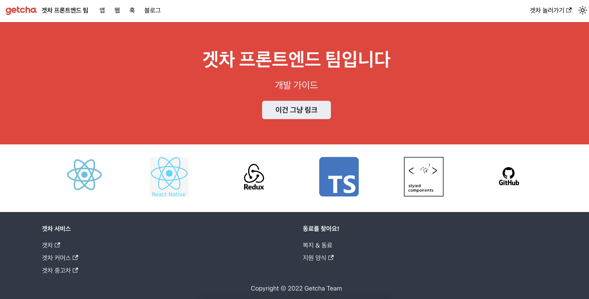
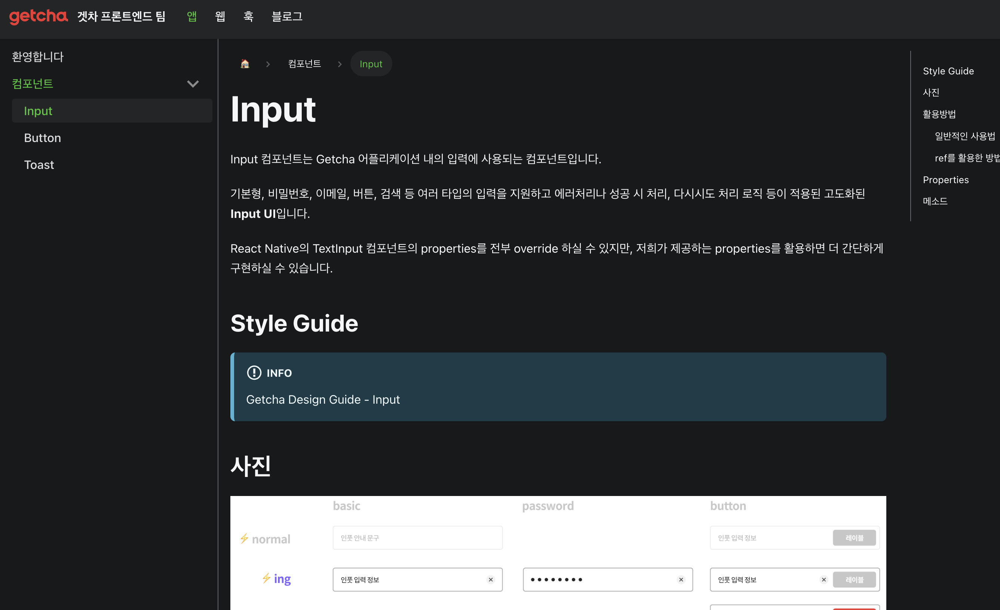
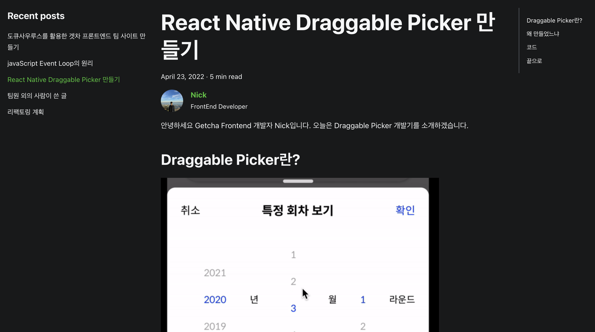
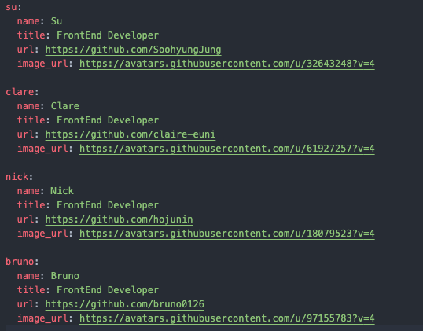
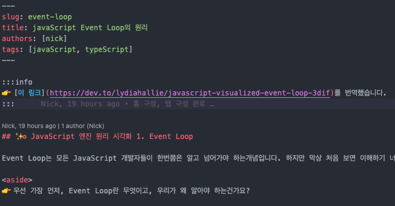

안녕하세요. Getcha 팀 FrontEnd 개발자 **Nick**입니다. 오늘은 페이스북의 정적 문서 생성 프레임워크인 도큐사우르스를 활용한 겟차 프론트엔드 팀 웹사이트 빌딩 과정을 소개하겠습니다.

저희 프론트엔드 팀은 이미 엄청나게 커진 겟차의 메인 **서비스 프로젝트 크기를 줄이는 목적**을 가진 리팩토링의 일환으로 *컴포넌트 라이브러리*를 만들기로 하고, 이 라이브러리의 설명 문서 또한 제작하기로 했습니다. 그러다가, 아예 만들거면 범용성 있게 만들자 하고 다음의 **목적**들을 달성할 수 있는 사이트를 만들기로 했습니다.

1. Getcha FrontEnd Team 소개 (**개발자님들 많이 지원해주세요 !!** 😆😆)
2. Ghetcha Components Library Docs
3. FrontEnd Tech Blog

처음엔 개츠비나 깃북같은 유명한 정적 문서 생성 프레임워크들을 생각했습니다. 아예 블로그를 시작부터 빌딩할 수준의 크기라고 생각해서였어요. 하지만 개발 리소스는 서비스 유지를 하기에도 바빴기 때문에 개발비용을 최소화해서 이런 수준의 사이트를 만들 수 있는 프레임워크인 **도큐사우루스**를 활용하기로 결정했습니다.

---

## 도큐사우루스란?

도큐사우루스는 facebook에서 개발한 React 기반 **정적 페이지 프레임워크**입니다.

:::info 도큐사우루스 방문하기

💡 [도큐사우루스](https://docusaurus.io/ko/) 공식 홈페이지

:::

도큐사우루스의 목적은 정말 심플하고 강력합니다. 아래 사진은 도큐사우루스 메인페이지에 나온 슬로건인데요. 이 한 문장 안에 도큐사우루스의 모든게 담겨있다고 볼 수 있습니다.


### 특징

도큐사우루스는 개츠비와 같이 이미 자주 사용되던 정적 페이지 생성기들과 다른 몇가지 특징이 있습니다.

1. 콘텐츠만 신경써도 될 정도로 간단하다.

   간단히 프로젝트만 만들어도, 당장 사용해도 될 만큼 **완성도 높은** 사이트가 나오고, **커스터마이징**도 간단합니다.
   검색이나 다크모드 같이 없으면 불편한 기능들이 전부 기본으로 제공됩니다.

2. 폴더 구조가 직관적이고 단순하다.

   하나의 상단 탭이 하나의 폴더이고, 그 하위에 모든 .md 파일이 위치하는 구조입니다.
   페이지 구성이 폴더 구조와 비슷해서 관리하기 용이합니다.

3. 마크다운 특성 상 **에디터** 구하기가 쉽다.

   예를 들어 이 글도 노션으로 작성하여 복사 & 붙혀넣기 만으로 만들어졌으며 따로 에디터를 구현하지 않아도 서식을 가져올 수 있어서 매우 편합니다. 타이포라나 노션, 컨플루언스 등등 MarkDown이 적용된 모든 에디터에서 복사해오면 빠르게 퍼블리싱 가능합니다. 또한 mdx (markdown + jsx)도 지원해서 javaScript 문법을 .md파일에서 사용 가능하다.

:::info 마지막 특징
!! 4. (마스코트 공룡🦖이 **매우** 귀엽다)
:::

물론 장점만 있는 것은 아닙니다. 마크다운 특성 상 글자 색 기능 같은 대부분의 블로그에서 지원하는 서식을 지원하지 않고, 모든 에디터에서 동일한 서식을 사용하는것도 아닙니다 (MD 자체로는 한계가 있습니다)

그럼에도 도큐사우루스에서는 그런 단점들을 상쇄할만한 장점들이 있습니다. 저는 처음 사용해보고 느낀점은 거의 모든 틀이 정해져있고 저희는 정말 콘텐츠만 넣어서 빌드하면 완벽한 웹사이트가 나오는 느낌이었습니다. 리액트 기반 프레임워크다보니 커스터마이징도 매우 쉽다는 장점도 있었구요.

이제 프로젝트 생성부터 진행해보겠습니다.

---

## 프로젝트 생성하기

먼저 준비할 것은 **_14_** 버전 이상의 Node.js입니다.

터미널을 열고, 다음 명령어를 입력해줍니다.

```bash
npx create-docusaurus@latest my-website classic --typescript
```

도큐사우루스 **최신버전**(2.xx beta)으로 my-website라는 **이름의 프로젝트**를, **classic** 플러그인(도큐사우루스 권장 플러그인)과 **타입스크립트** 버전으로 생성하는 명령어입니다.



잘 생성되었으면 해당 프로젝트로 들어가서, 다음 명령어를 통해 프로젝트를 실행시킵니다.

```bash
yarn start
```

그리고 결과물을 확인하면 아래 사진과 같습니다.



보이는 것 처럼 시작부터 거의 완성된 도큐먼트 친화적인 홈페이지가 나옵니다. 👍🏻

---

### docusaurus.config.js

docusaurus.config.js는 이 프로젝트의 설정이 담긴, 이 프로젝트 폴더에서 가장 중요한 파일입니다. 헤더나 탭, 푸터 구성 및 전체 테마, 플러그인 등 이 프로젝트에서 쓰이는 모든 설정을 이 파일에서 합니다.



### 커스터마이징

위에서 설명한 docusaurus.config.js에서 간단히 테마와 글로벌 스타일 등을 변경하면, 다음과 같이 잘 만들어진 팀 블로그같은 사이트가 만들어집니다.



이로써 원했던 모습의 사이트가 완성되었습니다. 물론 디자이너님에게 부탁드려서 더 이쁘게 꾸며달라고 요청해야겠지만, 일단은 기능은 하니까. 목적은 달성입니다.

이제 글을 쓰러 가봅시다.

---

## 문서

도큐사우루스에서 문서는 두가지 타입으로 구성되어 있고, 각각 커스터마이징 하는 방법이 약간 다릅니다.

### 1. Docs



Docs는 전형적인 Document입니다. .md파일로 작성되어 있고, 위에서 언급했듯이 노션이나 타이포라같은 편집기로 편하게 작성한 뒤 복사&붙혀넣기로 손쉽게 게시글을 작성할 수 있습니다.

작성된 글은 좌측 사이드바에서 네비게이팅 가능하고, 우측에서는 Heading type단위로 목차가 만들어집니다.

아래 좌우 페이지네이션도 제공합니다.

---

### 2. Blog

블로그 기능도 페이지마다 .md파일로 렌더링된다는 점에서 비슷하고 좌우 네비게이팅이나 인덱스가 만들어진다는 점에서도 Docs와 비슷합니다.



아래의 기능들은 블로그에만 있는 기능들로 이마저도 개발이 필요없는 수준으로 제공되고 있습니다.

### 작성자 & 태그 기능

author를 .yml config파일로 관리합니다. 물론 이 문서 내에서 관리되지 않는 사람도 프로필을 등록할 수 있지만 이 파일에서 관리되고 있는 사람은 Key 값으로 간단히 사람 정보를 가져올 수 있습니다.



아래는 블로그 게시글 작성 파일인데 authors에서 Key값으로 간단하게 저자 정보를 가져오는 것을 볼 수 있습니다.




또한 위 사진에서 tag array를 받는데, 나중에 해당 태그를 가진 게시글들만 모아서 볼 수 있는 기능도 제공합니다.

---

## 한계점

- 글을 작성하는게 그렇게 쉽지만은 않습니다. 비교대상이 다른 블로그 게시글 에디터이다 보니 그런 것 같습니다.

- 저는 특히 노션으로 작성한 뒤 옮기고 있는데, 노션엔 있는데 마크다운으로 지원하지 않는 서식이 있을 땐 그냥 나와버립니다. 이런 부분들은 일일이 찾아서 고쳐줘야 합니다.

- 특히 사진의 경우, 노션은 Signed URL이라는 S3 기능을 사용하는데 버킷에 사진을 등록하고 하루가 지나면 그 url은 사용할 수 없게 만듭니다. 다음 날은 다른 url이 되버려요.

- 그래서 저는 static asset들을 폴더에 넣어서 관리하다보니 시간이 지날수록 프로젝트 크기가 커지는 것을 느꼈습니다. 만약 활용하게 된다면 사진은 파일서버에 따로 올려두고 url을 받아다 쓰거나 Svg 변환기를 활용하는 수 밖에 없을 것 같습니다.

감사합니다.
