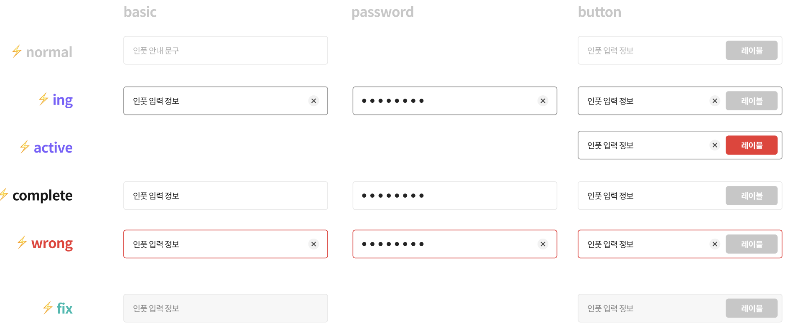

# 입력 컴포넌트

Input 컴포넌트는 Getcha 어플리케이션 내의 입력에 사용되는 컴포넌트입니다.

기본형, 비밀번호, 이메일, 버튼, 검색 등 여러 타입의 입력을 지원하고 에러처리나 성공 시 처리, 다시시도 처리 로직 등이 적용된 고도화된 **Input UI**입니다.

React Native의 TextInput 컴포넌트의 properties를 전부 override 하실 수 있지만, 저희가 제공하는 properties를 활용하면 더 간단하게 구현하실 수 있습니다.

## Style Guide

:::info
Getcha Design Guide - Input
:::

## 사진



## 활용방법

일반적인 Input 활용방법대로 사용하셔도 되지만 성능의 측면에서 ref로 값을 컨트롤하셔도 됩니다. forwardRef로 구현되었고, 여러 ref함수들을 활용하실 수 있습니다.

### 일반적인 사용법

부모 컴포넌트에서 state를 넘겨서 활용하는 사용방법입니다.

```tsx
import { Input } from "getcha-component/native";

const SearchBar = () => {
  const [value, setValue] = useState<string | undefined>("");
  return <Input value={value} setValue={setValue} type={"password"} />;
};
```

### ref를 활용한 방법

```tsx
import { Input } from "getcha-component/native";

const SearchBar = () => {
  const inputRef = useRef<InputRefType>(null);

  // input에 포커스
  const focusInput = inputRef.currunt.focus();
  // input값 가져오기
  const getInputValue = inputRef.current.getValue();

  return <Input ref={inputRef} type={"password"} />;
};
```

## Properties

| property       | type       | 설명                                                                                                                                                                                 | default  |
| -------------- | ---------- | ------------------------------------------------------------------------------------------------------------------------------------------------------------------------------------ | -------- |
| type           | InputType  | Input 컴포넌트 값의 타입입니다. 내부적으로 정규식을 통해 전화번호, 이메일, 비밀번호, 등 유효하지 않은 값을 에러처리하거나 마스킹 기능, 숫자에 comma를 붙혀주는 기능 등을 제공합니다. | ‘normal’ |
| error          | boolean    | 에러메시지를 띄울 조건입니다. error값이 true가 될 때 에러 UI로 변경됩니다.                                                                                                           | false    |
| errorMessage   | string     | 에러 UI가 렌더링될 때 아래에 표시되는 에러메시지입니다.                                                                                                                              | null     |
| label          | string     | Input 컴포넌트 좌측 상단에 나오는 Input 설명입니다.                                                                                                                                  | null     |
| labelStyle     | TextStyles | label 컴포넌트의 스타일값입니다.                                                                                                                                                     | null     |
| guideLabel     | string     | label 컴포넌트 우측에 나오는 안내메시지입니다                                                                                                                                        | null     |
| success        | boolean    | 성공 메시지를 띄울 조건입니다. success값이 true가 될 때 성공 UI로 변경됩니다.                                                                                                        | false    |
| successLabel   | string     | 성공 UI가 렌더링될 때 아래에 표시되는 성공메시지입니다.                                                                                                                              | null     |
| buttonLabel    | string     | Button이 있는 Input의 Button Label입니다.                                                                                                                                            | null     |
| onPressButton  | () ⇒ void  | Button이 있는 Input의 Button을 눌렀을 때 호출할 콜백함수입니다.                                                                                                                      | null     |
| buttonDisabled | boolean    | Button을 비활성화할 조건입니다.                                                                                                                                                      | false    |

## 메소드

ref를 넘겨주셨다면, Text Input 컴포넌트 메소드 및 저희가 제공하는 메소드들을 활용하실 수 있습니다.

| property  | 설명                                    |
| --------- | --------------------------------------- |
| focus     | Input에 포커스됩니다.                   |
| blur      | Input에서 포커스 아웃됩니다.            |
| clear     | Input값이 비워집니다.                   |
| isFocused | 포커스 되었을 때 true값으로 변합니다.   |
| getValue  | 부모 컴포넌트에서 Input값을 가져옵니다. |
| setValue  | 부모 컴포넌트에서 Input값에 set합니다.  |

---
