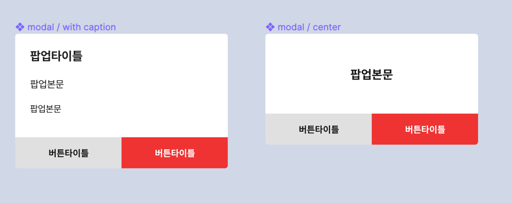

# 팝업

팝업 모달은 사용자의 선택이나 되물음 같은 중요한 상호작용을 재확인하는 용도로 사용되는 모달 컴포넌트입니다.

## 사진

---



## 사용법

---

앱 최상단에 선언하고 static 메소드로 호출합니다.
팝업의 버튼을 눌렀을 때 따로 함수를 호출하지 않아도 팝업이 자동으로 꺼지도록 되어있습니다.

### 선언부

안드로이드에서 Back Button을 제어하기 위해 react-navigation에 부여한 ref인 navigationRef를 넘겨줍니다.

```tsx
// App.tsx
return (...
<NavigationContainer ref={navigationRef}>

<Popup
  ref={(ref) => Popup.setRef(ref)}
  navigationRef={navigationRef}
/>
...
)
```

### 사용부 - 단순 텍스트를 넣는 경우

```tsx
import { Popup } from "Getcha-UI-Toolkit";

Popup.show({
  title: "게시글 삭제",
  description: "이 행동은 되돌릴 수 없어요.\n 삭제하시겠습니까?",
  leftButtonTitle: "취소",
  rightButtonTitle: "삭제하기",
  rightButtonPressed: deletePost,
});
```

### 사용부 - 컨텐츠를 넣는 경우

```tsx
import { Popup } from 'Getcha-UI-Toolkit'

  Popup.show({
    title: "게시글 삭제",
    contents: () => <Components/>,
    leftButtonTitle: "취소",
    rightButtonTitle: "삭제하기",
    rightButtonPressed: () => void
  })

```

## Properties

---

| name               | type      | 설명                                                                                                                                            | default |
| ------------------ | --------- | ----------------------------------------------------------------------------------------------------------------------------------------------- | ------- |
| title              | string    | 팝업 제목입니다.                                                                                                                                |         |
| description        | string    | 팝업 설명입니다. 컨텐츠가 없다면 이 컴포넌트가 렌더링됩니다.                                                                                    |         |
| contents           | ReactNode | 팝업 컴포넌트 내에 일반 글자가 아니라 컴포넌트가 들어가야하는 경우가 있습니다. 이 property에 컴포넌트를 넘겨주면, 해당 컴포넌트가 렌더링됩니다. | null    |
| leftButtonTitle    | string    | 팝업 왼쪽 버튼 라벨입니다.                                                                                                                      | “닫기”  |
| leftButtonPressed  | function  | 팝업 왼쪽 버튼을 눌렀을 때 호출되는 콜백입니다. 이 property를 넘겨주지 않아도 팝업을 닫는 콜백이 내장되어 있습니다.                             | null    |
| rightButtonTitle   | string    | 팝업 오른쪽 버튼 라벨입니다. 이 property가 없으면 오른쪽 버튼은 렌더링되지 않습니다.                                                            | null    |
| rightButtonPressed | function  | 팝업 오른쪽 버튼을 눌렀을 때 호출되는 콜백입니다.                                                                                               | null    |

## Method

---

| name   | 설명                                                                           |
| ------ | ------------------------------------------------------------------------------ |
| show   | 팝업 모달을 켭니다. 위의 Properties를 인자로 넘겨주면 됩니다.                  |
| close  | 팝업 모달을 닫습니다.                                                          |
| update | 팝업 모달의 내용을 변경합니다. 팝업을 연달아 켜야할 경우에 사용할 수 있습니다. |
