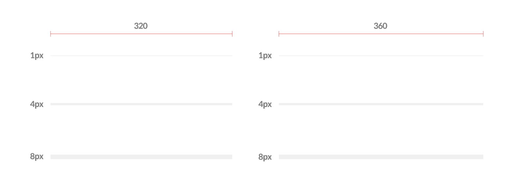

## 구분선

레아이웃 컴포넌트 내에서 논리단위를 구분해주는 구분자 컴포넌트입니다.

:::info

[겟차 디자인 시스템 - 디바이더](https://zeroheight.com/759a9cc46/p/6706c5-layout/b/67179c)을 기반으로 만들어졌습니다.

:::

## 사진

---



## 코드

ViewStyle 클래스를 상속받아 Divider Props를 정합니다.
기본 속성으로 배경색과 자주 사용하는 height를 부여하고, 예외 상황을 커버할 수 있도록 하기 위함입니다.
아래와 같이 구현할 수 있습니다.

```tsx
import React from "react";
import styled from "styled-components/native";
import { Colors } from "@Theme/Variables";
import { ViewStyle } from "react-native";

interface DividerProps extends ViewStyle {
  heightType: 1 | 4 | 8;
}

const Divider = ({ heightType = 1, ...otherStyles }: DividerProps) => (
  <Container height={heightType} style={otherStyles} />
);

export default Divider;

const Container = styled.View<DividerProps>`
  background-color: ${Colors.base.grey100};
  width: 100%;
  height: ${(props) => (props.heightType ? props.heightType : props.height)};
`;
```

```tsx
import { Divider } from 'Getcha-UI-kit'

return (
...
<SomeComponent/>

<Divider height={8}/>

<SomeComponent>
...
)

```
