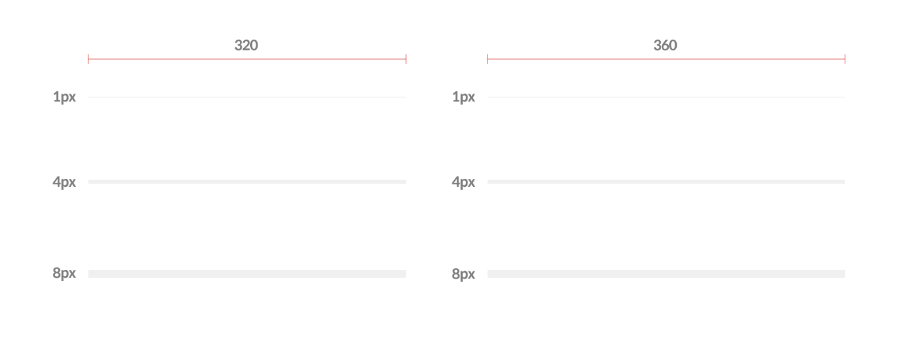

## 구분선

레아이웃 컴포넌트 내에서 논리단위를 구분해주는 구분자 컴포넌트입니다.

:::info

[겟차 디자인 시스템 - 버튼](https://zeroheight.com/759a9cc46/p/6706c5-layout/b/67179c)을 기반으로 만들어졌습니다.

:::

## 사진

---



## 코드

```tsx
import { Divider } from 'Getcha-UI-kit'

return (
...
<SomeComponent/>

<Divider height={8}/>

<SomeComponent>
...
)

```
