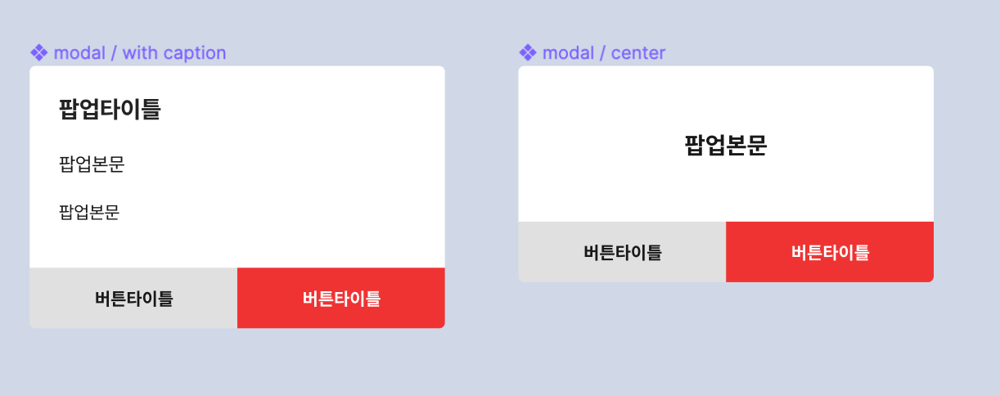

# 팝업 모달

팝업 모달은 사용자의 선택이나 되물음 같은 중요한 상호작용을 재확인하는 용도로 사용되는 모달 컴포넌트입니다.

## 사진

---



## 사용법

---

앱 최상단에 선언하고 Context API나 Redux, Mobx같은 상태관리 라이브러리로 제어합니다.

### 선언부

```tsx
// App.tsx
return (...
<Popup/>
...
)
```

### 사용부

```tsx
const dispatch = useAppDispatch();

dispatch(
  handlePopupShowAction({
    popUpTitle: "게시글 삭제",
    popUpDescription: "이 선택은 되돌릴 수 없습니다.\n 진행하시겠습니까?",
    popUpLeftButtonTitle: "닫기",
    popUpRightButtonPressed = deletePostCallback,
    popUpRightButtonTitle: "삭제하기",
  })
);
```

## Properties

---

| name                    | type      | 설명                                                                                                                                            | default |
| ----------------------- | --------- | ----------------------------------------------------------------------------------------------------------------------------------------------- | ------- |
| popUpTitle              | string    | 팝업 제목입니다.                                                                                                                                |         |
| popUpDescription        | string    | 팝업 설명입니다. 컨텐츠가 없다면 이 컴포넌트가 렌더링됩니다.                                                                                    |         |
| popUpContent            | ReactNode | 팝업 컴포넌트 내에 일반 글자가 아니라 컴포넌트가 들어가야하는 경우가 있습니다. 이 property에 컴포넌트를 넘겨주면, 해당 컴포넌트가 렌더링됩니다. | null    |
| popUpLeftButtonTitle    | string    | 팝업 왼쪽 버튼 라벨입니다.                                                                                                                      | “닫기”  |
| popUpLeftButtonPressed  | function  | 팝업 왼쪽 버튼을 눌렀을 때 호출되는 콜백입니다. 이 property를 넘겨주지 않아도 팝업을 닫는 콜백이 내장되어 있습니다.                             | null    |
| popUpRightButtonTitle   | string    | 팝업 오른쪽 버튼 라벨입니다. 이 property가 없으면 오른쪽 버튼은 렌더링되지 않습니다.                                                            | null    |
| popUpRightButtonPressed | function  | 팝업 오른쪽 버튼을 눌렀을 때 호출되는 콜백입니다.                                                                                               | null    |
