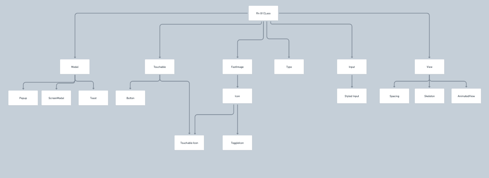

## 겟차 앱

이 문서에는 겟차 앱에서 사용되는 컴포넌트를 설명합니다.

## UI 추상화 수준

겟차의 UI 컴포넌트 추상화 수준입니다.
가장 낮은 수준에 React Native 기본 라이브러리가 있습니다.
이를 기본 스타일 및 기능을 보강한 6가지 컴포넌트를 만들었고, 해당 컴포넌트를 상속받아 다양한 컴포넌트들을 생성했습니다.

:::tip 클래스 구조

프론트엔드에서 OOP 개념과 class는 잘 쓰이지 않죠. 컴포넌트 객체 또한 상속이 불가능하니까요.
하지만 props 타입은 상속이 되고, 그 구조를 그대로 **부모-자식** 관계로 모방이 가능해서 위와 같은 형태로 표현할 수 있습니다.

:::
